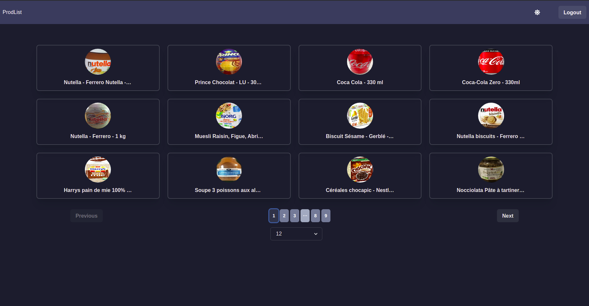
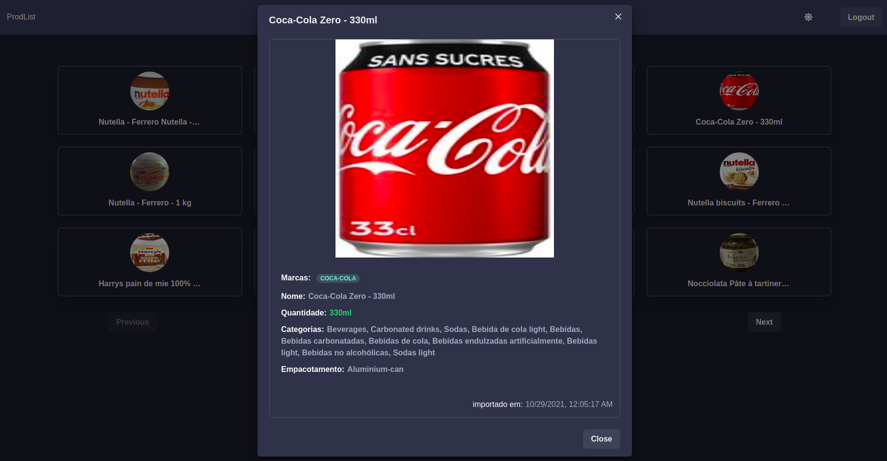

<h1 align="center">Welcome to fullstack-challenge-2021-coodesh-frontend 👋</h1>
<p>
  
  <a href="https://mit-license.org" target="_blank">
    
  </a>
</p>

<div align="center">
  <h3 align="center">Coodesh Challenge</h3>
  <p align="center">
  an incredible project that extracts products from a web page and serves in a REST API
  </p>
  <br/>
  <a href="https://lab.coodesh.com/wja1/fullstack-challenge-2021?utm_source=mail&utm_medium=sendgrid&utm_campaign=website"><strong>For more information see the challenge repository</strong></a>

</div>

# DEMO





---

### Built With

This section should list any major frameworks/libraries used to bootstrap your project. Leave any add-ons/plugins for the acknowledgements section. Here are a few examples.

- [react.Js](https://reactjs.org/)
- [chakra-ui](https://chakra-ui.com/)
- [emotion](https://emotion.sh/docs/@emotion/react)
- [typescript](https://www.typescriptlang.org/)
- [react-router-dom](https://www.npmjs.com/package/react-router-dom)
- [jest](https://jestjs.io/docs/getting-started/)
- [docker](https://www.docker.com/)
- [docker compose](https://docs.docker.com/compose/)

## Getting Started

Instructions on setting up your project locally.
To get a local copy up and running follow these simple example steps.

### Prerequisites

List things you need to use the software and how to install them.

#### Roadmap

- [x] docker
- [x] docker compose

### Installation

1. Clone and configure the repo

   [coodesh-fullstack-challenge-2021-api](https://github.com/wdev007/coodesh-fullstack-challenge-2021-api)

2. Change the settings files
   ```sh
   cp .env.example .env
   ```

## Usage

```sh
docker-compose up
```

## Run tests

```sh
yarn run test
```

## Author

👤 **Wellici Araujo**

- Github: [@wdev007](https://github.com/wdev007)

## Show your support

Give a ⭐️ if this project helped you!

## 📝 License

Copyright © 2021 [Wellici Araujo](https://github.com/wdev007).<br />
This project is [MIT](https://mit-license.org) licensed.

---

_[Challenge by coodesh](https://coodesh.com/)_
